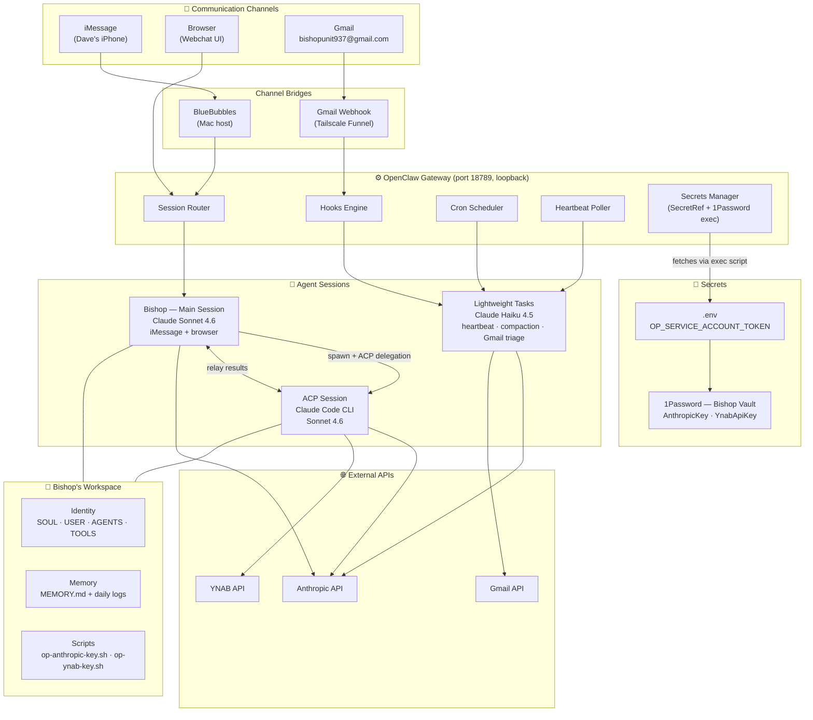
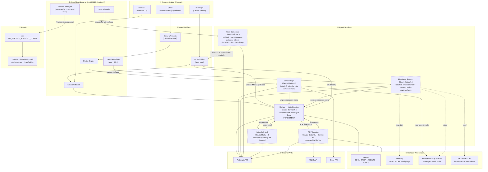

# Bishop Architecture

## Before (pre-2026-04-21)



**Problem:** Hooks, crons, and heartbeat all routed to an isolated Haiku session that delivered directly to Dave — no shared context with Bishop's main session. Dave got messages from two different "Bishops" with no awareness of each other. Crons didn't know if a conversation was active. Gmail had no context about Dave's day.

---

## After (target architecture)



**Key principle (refined 2026-04-30, simplified after testing):** Single voice = single persona + single shared transcript. **The iMessage thread itself is the shared transcript.** When the cron's isolated Haiku delivers via the iMessage channel, Bishop reads the same channel on his next interactive turn — no explicit transcript-write step needed. We don't need every outbound generated by main's LLM, and we don't need an explicit mirror primitive either.

Two classes of outbound traffic:

- **Conversational** (replies to Dave's messages, ad-hoc check-ins Bishop chooses to send): composed and delivered by Bishop's main session. Single LLM call, full context.
- **Pre-authored intents** (named cron reminders Dave configured himself): composed by an isolated Haiku, delivered directly via the channel. The shared iMessage thread carries the context — Bishop sees what went out via the channel itself and can address Dave's reply with full continuity. **No explicit mirror needed.**

The asymmetry is deliberate: routing pre-authored intents through main was attempted in the 2026-04-22 refactor and shipped a runtime hazard (see "Runtime Discovery 2026-04-30"). The architecture restores the deterministic isolated path for those, while keeping inbound and conversational outbound unified through main.

| Input | Path | Model |
|-------|------|-------|
| iMessage / browser | → main session directly | Sonnet |
| Crons (named pre-authored intents) | → isolated Haiku composes + announce-delivers via channel; shared iMessage thread carries context to main | Haiku |
| Heartbeat tick | → isolated Haiku session → drains inbox-queue, maintains memory → `sessions_send` to Bishop when actionable | Haiku (+ Sonnet only if surfaced) |
| Gmail urgent | → Haiku triage → `sessions_send` → Bishop | Haiku + Sonnet |
| Gmail non-urgent | → Haiku triage writes to `inbox-queue.md` → heartbeat drains → `sessions_send` to Bishop if warranted | Haiku only until surfaced |
| Complex tasks | → Bishop spawns ACP, relays result | Sonnet + ACP |
| Lightweight sub-tasks | → Bishop spawns Haiku, relays result | Haiku |

---

## Channel Extensibility

**Principle:** Every user-facing channel delivers to and from the main session. No channel bypasses Bishop. Cheap triage and sub-tasks may run outside main, but their output flows back through Bishop before reaching Dave.

**Adding a new channel (Slack, Discord, SMS, Signal, etc.):**
1. openclaw `ChannelPlugin` for inbound parsing + outbound delivery, configured under `channels.<name>`.
2. Ingress routing: either `dmScope: "main"` for that channel, or hook mapping with static `sessionKey: "main"` (requires `"main"` in `allowedSessionKeyPrefixes`).
3. No bespoke per-channel session logic. Channel identity and threading keys (Slack `thread_ts`, email `Message-ID`, Discord reply) travel on the message envelope.

**Known gotcha:** `session.dmScope` defaults to `"per-channel-peer"`. iMessage lands in `main` today only because BlueBubbles routes by convention. Any new channel added without addressing `dmScope` will silently create per-peer sessions and break the single-voice principle.

**Triage vs. direct per channel:**

| Channel | Pattern | Why |
|---|---|---|
| iMessage | Direct → main | Dave is the only sender, always intentional |
| Browser webchat | Direct → main | Same |
| Gmail | Haiku triage → main | High volume, mostly non-urgent; classification pays for itself |
| Slack / Discord (future) | Direct → main | Low volume, interactive; add triage only if noise warrants |
| SMS (future) | Direct → main | Same reasoning as iMessage |

---

## Operational Guarantees

The single-session pattern has known failure modes. These must be addressed in config and AGENTS.md, not left implicit.

### Context and compaction
- Main session accumulates all channels until 4 AM reset or compaction fires.
- Compactor model: Haiku (configured). Verify compaction threshold is aggressive enough for a multi-channel day.
- Post-compaction reinjected sections: `postCompactionSections: ["Session Startup", "Red Lines"]` (openclaw default). AGENTS.md must have these named sections containing non-negotiable invariants.
- MEMORY.md is the durable cross-reset substrate. Anything Bishop needs past 4 AM goes there, not the transcript.

### Inbox-queue drain
- Gmail triage writes non-urgent emails to `memory/inbox-queue.md`.
- **Heartbeat owns the drain.** Each tick, the isolated heartbeat session reads the queue, decides whether anything has become worth surfacing (age, accumulation, topic), and `sessions_send`s a consolidated note into Bishop. Drained entries are trimmed from the file.
- **Failsafe:** Bishop's AGENTS.md "Session Startup" section instructs Bishop to check `inbox-queue.md` directly if recent turns reference it. Catches missed drain cycles (heartbeat disabled, clock skew, etc.).

### Heartbeat
- **Role:** Inbox drainer + memory janitor. Not a delivery channel, not a proactive-reminder channel (crons handle named reminders).
- **Isolation:** Runs in isolated Haiku session (`heartbeat.isolatedSession: true`). Does not see Bishop's transcript. This is the critical cost setting — without it, every tick pays Haiku-priced input on the full accumulated main session.
- **Reads:** `HEARTBEAT.md` (instructions), `memory/inbox-queue.md` (to drain), recent `memory/YYYY-MM-DD.md` (for maintenance).
- **Writes:** Distilled entries into `MEMORY.md`, trimmed queue entries in `inbox-queue.md`.
- **Delivers:** Only via `sessions_send` into Bishop when something needs Dave's attention. **Never directly to Dave. Never to iMessage.** Bishop decides how / whether to surface.
- **Quiet rules:** Late night (11 PM - 8 AM) stay silent unless genuinely urgent. If Bishop has texted Dave within the last 30 min, stay silent unless the signal is materially different.
- **Default response:** `HEARTBEAT_OK` with no surfacing. Silent is the norm.

### Idle-gating for scheduled sends
- Crons (medication, wind-down) and heartbeat-triggered proactive messages must not interrupt an active conversation.
- Convention: cron payload includes "only deliver if last user message > 10 min ago; otherwise log and skip."

### Triage decision logging
- Haiku's urgent/non-urgent call is load-bearing. A missed urgent = silent failure.
- Log every triage decision to `logs/gmail-triage.jsonl` (input subject/from + decision + reasoning). Sample-audit weekly until calibrated.

### Canary / persona check
- One voice = one point of persona failure. A bug in AGENTS.md hits every channel simultaneously.
- Browser webchat serves as a low-stakes canary; drift shows up there before it reaches iMessage.

### Cost model
Sonnet cost scales with (main session turns × average context size). The main risk is context accumulation over a long day. Known leaks to audit:

1. **Heartbeat reads full main history.** Default `heartbeat.isolatedSession: false` pays Haiku-priced input on the full accumulated main transcript every 30 min. Setting to `true` (heartbeat reads only `HEARTBEAT.md`) is likely the single biggest cost win.
2. **Triage relays full email body to main.** Haiku should `sessions_send` a 1-sentence summary + label, not the body. Body stays in Haiku's ephemeral session.
3. **Sub-task result relay.** ACP and Haiku sub-task outputs can be long; summarize before injecting back into Bishop.
4. **Compaction aggressiveness.** Verify compaction fires mid-day on heavy days, not only at 4 AM reset.

---

## Runtime Discovery (2026-04-30)

Investigating why the 3pm meds reminder fired but never reached Dave revealed a hazard in the cron-via-main path that was not visible at design time. This drove the principle refinement above.

**What `sessionTarget: "main"` + `wakeMode: "now"` actually does** (per `plugin-runtime-deps/.../hook-client-ip-config-B6ymtVEi.js:1067-1146`):

1. Enqueues the cron's `systemEvent` text into main's queue.
2. Calls `runHeartbeatOnce` against main's session — i.e., triggers a *heartbeat-flavored* Sonnet turn, not a normal conversational turn.
3. The heartbeat agent's system prompt (`heartbeat-runner-Dd4J0PXH.js:472`) ends with `"After completing all due tasks, reply HEARTBEAT_OK."` — so the turn is told to do housekeeping and may reply with `HEARTBEAT_OK` instead of composing a message for Dave.
4. The cron logs `status: "ok"` the moment the heartbeat turn returns, regardless of whether it actually emitted an outbound message. The `summary` field in `cron/runs/*.jsonl` is just the prompt text echoed back, not the model's reply.

**Symptom:** runs from before 2026-04-22 logged `model`, `usage`, real generated text, and `delivered: true` (the original isolated cron pattern). Runs after the refactor log no model/usage, prompt echoed as summary, and `deliveryStatus: "not-requested"`. The 4/22 refactor swapped a deterministic delivery for a probabilistic one without anyone noticing because *some* runs do still happen to send.

**Also discovered:** `agents.defaults.heartbeat.isolatedSession: true` only affects the regular :28/:58 heartbeat ticks. The cron-triggered heartbeat hard-codes `sessionKey: targetMainSessionKey` (line 1094) and ignores the isolation setting.

**Implication for architecture:** "single voice through main" works for *inbound* (channel cohesion is real) and *conversational outbound* (Bishop chooses what to say). It does not work for *pre-authored intents* like named reminder crons — those have no LLM-decision-making to centralize, so routing them through main only adds a heartbeat-piggyback step that can drop the message. The pre-refactor isolated pattern (proven by `honda-fit-search` continuing to deliver reliably today) is the right shape for intents.

---

## Second Discovery (2026-04-30, late evening) — `hasOutboundSideEffects` poisons announce

After reverting the three reminder crons to `sessionTarget: "isolated"` + `payload.kind: "agentTurn"` + `delivery: { mode: "announce", channel: "last" }`, two of the three test fires (3pm, winddown-9pm) still failed to deliver. Noon worked. The A/B difference: noon's prompt did NOT instruct the agent to call `sessions_send` to mirror; the other two DID.

**Root cause** in `plugin-runtime-deps/.../result-fallback-classifier-BfQx-pcn.js:16`:

```javascript
function hasOutboundSideEffects(result) {
    return result.didSendViaMessagingTool === true
        || (result.messagingToolSentTargets?.length ?? 0) > 0
        || (result.successfulCronAdds ?? 0) > 0
        || (result.meta.toolSummary?.calls ?? 0) > 0;   // ← ANY tool call counts
}
```

Any tool call by the agent — even one that *fails* — sets `meta.toolSummary.calls > 0`, which makes `hasOutboundSideEffects` return true, which causes the runtime to **skip the announce fallback delivery**, on the assumption "the agent already did the outbound work itself." The agent's final text reply is composed and logged but never sent.

The cron's `sessions_send` mirror call had been failing with `forbidden` (the visibility=tree restriction we'd identified earlier), but even *if* it had succeeded, the very *act of calling it* would still suppress announce delivery via this clause. Same outcome.

**Fix applied:** strip the `sessions_send` workflow step from each cron prompt. Agent makes zero tool calls → `hasOutboundSideEffects` returns false → announce fallback fires → iMessage delivered. Confirmed by Dave's A/B: noon (no tool call instruction) delivered; pre-fix 3pm/winddown (with the instruction) did not; post-fix 3pm/winddown delivered.

**Phantom mirror:** With `sessions_send` removed, we wondered whether Bishop would have any context for what was sent. Dave tested by asking Bishop on iMessage about the last three sent messages — Bishop answered correctly. **The shared iMessage thread itself is the transcript.** When the cron's outbound goes into the BB channel, Bishop reads it on the next interactive turn. No explicit mirror primitive is needed, ever. This is the simpler, more robust architecture and is the one we're standardizing on.

**Stale config that's now moot:** the `tools.sessions.visibility: "all"` change made earlier in the session was a fix for the failed `sessions_send` mirror. With the mirror removed entirely, this setting no longer matters for the cron path. Leave it in place (it doesn't hurt) but note it's not load-bearing for current correctness.

---

## Implementation Status

| # | What | File | Priority | Status |
|---|------|------|----------|--------|
| 0 | Live bug: Gmail hook had Haiku delivering directly to Dave — subsumed into item 4 | `~/.openclaw/openclaw.json` L180-182 | **NOW** | ✅ Done (2026-04-22) |
| 1 | Crons → `sessionTarget: main` | `~/.openclaw/cron/jobs.json` | — | ✅ Done |
| 1a | **Payload kind mismatch:** yesterday's `sessionTarget: "main"` fix left `payload.kind: "agentTurn"` unchanged, but main-targeted crons require `payload.kind: "systemEvent"` with a `text` field. All 3 reminders silently skipped for ~24h with `lastError: "main job requires payload.kind=\"systemEvent\""`. Also added `failureAlert` per job so a future silent-skip surfaces to Dave within one cycle. | `~/.openclaw/cron/jobs.json` | **NOW** | ✅ Done (2026-04-22) |
| 1b | **BlueBubbles Private-API dependency:** typing indicators (`agents.defaults.typingMode`) and read receipts (`channels.bluebubbles.sendReadReceipts`) both require the BlueBubbles Private API helper on the Mac host. Helper is not installed, so those calls hang and AbortController times out → *whole Bishop turn* aborts with `"This operation was aborted"` (surfaced as `[bluebubbles] final reply failed` and as cron `lastErrorReason: "timeout"`). Disabled both in config. Sends now rely on the BB public API only; no helper install needed. If Dave wants typing/read-receipt UX later, install the BB Private API helper on the host and flip both back on. | `~/.openclaw/openclaw.json` | **NOW** | ✅ Done (2026-04-22) |
| 2 | Strip "Route to Haiku:" from cron payloads | `~/.openclaw/cron/jobs.json` | Next | ✅ Done (2026-04-22) |
| 3 | Update AGENTS.md routing section; ensure "Session Startup" + "Red Lines" sections exist with inbox-queue drain + guardrails | `workspace/AGENTS.md` | Next | ✅ Done (2026-04-22) |
| 4 | Gmail hook → Haiku triage → `sessions_send` pattern (`deliver: false`, triage produces 1-sentence summary, not body) | `~/.openclaw/openclaw.json` | Next | ✅ Done (2026-04-22) |
| 5 | Archive SESSION-ROUTING.md (superseded) | `workspace/projects/SESSION-ROUTING.md` | Later | ✅ Done (2026-04-22) — moved to `projects/archive/` |
| 6 | ~~Revisit~~ Archive model-tiering.md — superseded, design was never quite right | `workspace/projects/model-tiering.md` | Later | ✅ Done (2026-04-22) — moved to `projects/archive/` |
| 7 | Set `heartbeat.isolatedSession: true` (biggest cost win — see Cost model above) | `~/.openclaw/openclaw.json` | Next | ✅ Done (2026-04-22) |
| 8 | Add `"main"` to `hooks.allowedSessionKeyPrefixes` if any hook needs to target main directly | `~/.openclaw/openclaw.json` | If needed | ⚪ Not needed — Gmail uses triage+sessions_send, not direct |
| 9 | Decide `session.dmScope` policy (flip to `"main"` globally, or document per-channel override requirement) | `~/.openclaw/openclaw.json` | Next | ✅ Done (2026-04-22) — flipped to `"main"` |
| 10 | Idle-gating convention in cron payloads (only deliver if last-user-message > 10 min) | `~/.openclaw/cron/jobs.json` | Later | ⏳ Pending |
| 11 | Triage decision logging to `logs/gmail-triage.jsonl` | Haiku triage prompt | Later | ⏳ Pending |
| 12 | Rewrite `HEARTBEAT.md` for new pattern (no direct delivery, drain inbox-queue, memory maintenance, `sessions_send` only). Current content tells Haiku to "text Dave" — same split-voice bug class as item 0 | `workspace/HEARTBEAT.md` | Next | ✅ Done (2026-04-22) |
| 13 | **Revert reminder crons to isolated/agentTurn pattern** to escape the heartbeat-piggyback hazard. Each cron: composes via Haiku, delivers via `delivery: { mode: "announce", channel: "last" }`. Originally included a `sessions_send` mirror — removed in item 13a after the second discovery. | `~/.openclaw/cron/jobs.json` | **NOW** | ✅ Done (2026-04-30) |
| 13a | **Strip `sessions_send` instruction from cron prompts** — any tool call (even a failed one) trips `hasOutboundSideEffects` and suppresses the announce delivery. Cron prompts now instruct: "Do not call any tools. Your reply is delivered verbatim by the cron worker." Validated end-to-end via test fires of all three crons; Dave confirmed Bishop still has full context of sent messages on next interactive turn (iMessage thread = shared transcript). | `~/.openclaw/cron/jobs.json` | **NOW** | ✅ Done (2026-04-30 late) |
| 14 | Update AGENTS.md cron-handling section: previously claimed cron signals arrive in main's session as `[CRON: ...]`. Under the actual working model, crons compose+deliver in isolation; Bishop sees outbound via the BB channel itself, not via an injected event. | `workspace/AGENTS.md` | Next | ⏳ Pending |
| 15 | Idle-gating preflight in cron Haiku prompt (item 10's spec): "If Dave's last iMessage was within 10 min, skip silently." This is harder under the no-tool-calls constraint — needs either a runtime feature (cron-time idle check pre-injected into the prompt) or accepted as a limitation. | `~/.openclaw/cron/jobs.json` | Later | ⏳ Pending |
| 16 | **Validate via natural firing tomorrow noon** (2026-05-01 12:00 PT). Manual `Run` button worked for all three; need to confirm scheduled trigger lands the same way. If yes: arc closes; if no: investigate scheduler-vs-manual-run differences. | `~/.openclaw/cron/jobs.json` | **NOW** | ⏳ Pending — waiting for noon |
| 17 | **`honda-fit-search` web_search broken.** Direct test (`openclaw capability web search --query ...`) returns `TypeError: fetch failed`. Config has `tools.web.search.provider = "ollama"` but Ollama isn't running / isn't search-capable. Bishop's "MiniMax API key" error message is the fallback path. Plan: get a Brave Search free-tier key (2k queries/mo), store in 1Password matching the Anthropic/YNAB pattern, switch provider to brave. Not done tonight. | `~/.openclaw/openclaw.json` + 1Password | Later | ⏳ Pending |

---

## Answers from Opus 4.7 (2026-04-22)

1. **`wakeMode: "next-heartbeat"`** injects into the existing session named by `sessionKey` (does not spawn). Degrades to `"now"` behavior if heartbeat is disabled. Safe default for non-urgent hooks.
2. **`HookMappingConfig` has no `sessionTarget`, only `sessionKey`** — confirmed. Two valid paths:
   - **Direct**: static `sessionKey: "main"` (requires adding `"main"` to `hooks.allowedSessionKeyPrefixes`). Simpler, no triage layer.
   - **Triage**: templated `sessionKey: "hook:gmail:{{id}}"` with `deliver: false`, Haiku session calls `sessions_send` into main. This is the chosen pattern for Gmail.
3. **Main session key is `"main"`** (openclaw `DEFAULT_MAIN_KEY`). Stable across the 4 AM daily reset — transcript archives, key persists.

---

## Session Notes — April 21, 2026

**Saved by:** Claude Code (ACP session — Bishop's gateway was down, worked directly on files)

### What was done tonight

Gateway was failing with two sequential errors:
1. `hooks.allowedSessionKeyPrefixes is required when a hook mapping sessionKey uses templates`
2. `hooks.defaultSessionKey must match hooks.allowedSessionKeyPrefixes`

**Fix applied:** Added `"allowedSessionKeyPrefixes": ["hook:"]` to `hooks` section of `openclaw.json`. Covers both `hook:ingress` (defaultSessionKey) and `hook:gmail:*` (template keys). Gateway is now up.

Git commit **`7770cdf`** — "refactor to single-session architecture: all crons route through main session" — refactored `AGENTS.md` routing section to reflect the single-session decision.

### Pending fixes (exact details)

**1. Cron payloads — `~/.openclaw/cron/jobs.json`**
All three jobs have stale "Route to Haiku:" instructions that contradict the new architecture:
- `medication-noon`: `"...Route to Haiku: send a brief, warm reminder..."`
- `medication-3pm`: `"...Route to Haiku: send a brief, warm reminder..."`
- `winddown-9pm`: `"...Route to Haiku: ask what his plan is for the night..."`
Strip the "Route to Haiku:" prefix from each. Bishop handles these directly.

**2. AGENTS.md — `workspace/AGENTS.md` ~line 182**
Routing section still lists Haiku as an option for cron signals. Should say Bishop handles cron signals directly, period.

**3. Gmail hook — `~/.openclaw/openclaw.json`**
Current: `sessionKey: "hook:gmail:{{messages[0].id}}"` — new isolated session per email.
Target: implement Haiku triage → `sessions_send` pattern (see After diagram above).
Interim option: change to `sessionKey: "hook:ingress"` to at least stop per-email isolation.

**4. SESSION-ROUTING.md — `workspace/projects/SESSION-ROUTING.md`**
The peer-mesh/`check_routing.py` approach is superseded. Archive or delete.

**5. model-tiering.md — `workspace/projects/model-tiering.md`**
Targets 70-80% Haiku. No longer accurate — Haiku is only for heartbeat, compaction, and Bishop-spawned sub-tasks. Revisit projections.

### System state as of tonight

- Gateway: **up**, launchd service `ai.openclaw.gateway`, port 18789
- iMessage via BlueBubbles: working
- Gmail hook: wired but broken (per-email isolated sessions) — fix pending
- Cron jobs: `sessionTarget: "main"` ✓ — payloads have stale Haiku instructions ✗
- ACP: enabled, `permissionMode: approve-all`
- 1Password: working, token in `~/.openclaw/.env`

---

## Infrastructure

- **Gateway:** OpenClaw, port 18789, loopback, launchd service (`ai.openclaw.gateway`)
- **Secrets:** 1Password exec via `op-anthropic-key.sh` — token in `~/.openclaw/.env`
- **ACP:** `acpx` backend, `permissionMode: approve-all`
- **Session resets:** daily at 4 AM, idle timeout 60 min

---

## Skills as the unit of feature packaging (2026-05-01)

OpenClaw's first-class concept for capability packaging is the **skill**: a directory with a `SKILL.md` (frontmatter + instructions Bishop reads) and any stencils/scripts that go with it. Bundled skills live under the OpenClaw install (`/opt/homebrew/lib/node_modules/openclaw/skills/`); local user-defined skills live under `workspace/skills/`.

**The pattern Dave validated through extensive debugging is now packaged as the local skill `alert-circuit`** (`workspace/skills/alert-circuit/`). When Dave asks Bishop to "set up an alert for X," Bishop:

1. Reads `workspace/skills/alert-circuit/SKILL.md`
2. Collects the four ingredients (upstream filter, channel + recipient, template, test fire)
3. Applies the matching stencil from `workspace/skills/alert-circuit/stencils/`
4. Writes the test-fire and trace scripts
5. Hands back the test command and validation criteria

This replaces "edit configs and debug for an hour" with "apply the skill recipe." Future capabilities should follow the same packaging convention: validated pattern → local skill in `workspace/skills/<name>/`.

**On ClawHub (the public skill marketplace):** treat it like npm. Class A skills (capability extensions like `1password`, `bluebubbles`, `gmail`) get normal vetting. Class C skills (those that deliver to user channels in their own voice — e.g. `gmail-secretary`) would re-introduce the split-voice bug we fixed and should not be installed without major reconfiguration. See `workspace/skills/alert-circuit/SKILL.md` for the classification framework.

---

## Three-Part Model (2026-05-01) — the canonical principle

After two days of debugging crons and email alerts, the model that holds:

1. **Bishop routes inbound work.** Every external message (iMessage, browser, Gmail, future channels) lands in Bishop's main session. He decides: handle it, delegate to a Haiku sub-task, or delegate to Claude Code (ACP). Results flow back through Bishop before reaching Dave. **LLM judgment is appropriate here** — that's the whole point of routing.

2. **Short-circuits handle pre-authored outbound delivery.** Crons, webhook-triggered alerts, and any other "I already know what to send" path bypass Bishop's main session entirely. They use OpenClaw's canonical pattern: an isolated Haiku agent emits a templated message, and `deliver: true` + explicit `channel` + `to` ships it directly to the destination. **No LLM judgment in the delivery path.** Pre-authored intents don't need re-decision.

3. **Two awareness substrates: the iMessage thread + `inbox-queue.md`.** Bishop's continuity doesn't need an explicit mirror primitive.
   - When outbound lands in the iMessage thread (cron reminders, refurb alerts), the thread itself is the mirror. Bishop reads it on the next interactive turn.
   - When outbound doesn't land in iMessage (background classifications, non-urgent emails, webhook results), it goes to `memory/inbox-queue.md`. The heartbeat drains the queue and `sessions_send`s into Bishop only when something has aged or accumulated enough to warrant his attention.

That's the whole architecture. Inbound = LLM-mediated routing. Outbound = deterministic short-circuits. Awareness = thread + queue file.

### When to reach for which

| Goal | Pattern |
|---|---|
| "Tell me when X happens" (where X is a known trigger) | Short-circuit (hook or cron with `deliver: true` + channel + to) |
| "Help me with Y" (where Y needs reasoning) | Inbound → Bishop routes |
| "Quietly track Z for later" | Write to `inbox-queue.md`, heartbeat drains |
| "Hey Bishop, set up an alert when..." | Bishop translates intent into a short-circuit hook/cron config (future work) |

The "Hey Bishop, set up an alert" path is what lets users add new circuits via natural language. It's the natural endpoint of the three-part model — Bishop's job becomes writing config files for new short-circuits, not gating their delivery.

---

## Testing Principle (2026-05-01)

Every circuit must be **forensically debuggable in under 60 seconds** or the logging is insufficient. Three concrete requirements per circuit:

1. **A way to fire it deliberately.** Don't depend on a real-world trigger to test. Each circuit has a `scripts/test-<name>.sh` that synthesizes a payload and fires the hook/cron directly. Three clean consecutive fires before declaring the circuit reliable.
2. **A per-hop trace.** Every hop in the path (received → processed → delivered) leaves a log entry that names what happened. Scattered logs are fine if a single trace script can pull them in order.
3. **A `scripts/trace-<name>.sh` helper** that takes a run identifier (or "most recent") and prints the per-hop summary. Failure should be traceable to the breaking hop without grepping multiple files by hand.

If a circuit doesn't have all three, it's not ready to depend on. Debugging by inference (last week's mode) is what produced the silent-failure ratchet.

### Email circuit (refurb-tracker alert) — current state

- **Fire deliberately:** `scripts/test-email-circuit.sh` (alert branch) or `scripts/test-email-circuit.sh queue` (log branch).
- **Trace:** `scripts/trace-email-circuit.sh [msg_id]`.
- **Hops:** (1) webhook received → (2) hook mapping selected → (3) Haiku decision (alert vs queue) → (4) channel delivery to BlueBubbles.
- **Pass criteria:** ALERT branch produces a `chat.send` event in `gateway.log` and an iMessage on Dave's phone. LOG branch produces a new line in `inbox-queue.md` and **no** `chat.send`.

### Cron circuits (medication-noon, medication-3pm, winddown-9pm) — partial

- **Fire deliberately:** `openclaw cron run <id>` or the OpenClaw web UI's `Run` button.
- **Trace:** `cron/runs/<id>.jsonl` shows model + usage + delivery status; `gateway.log` shows the `chat.send`.
- **Pending:** unified `scripts/trace-cron.sh` to make 60-second forensic-trace match the email circuit.

---

## Session Notes — May 1, 2026 (evening, resolved)

**Where we are: refurb-alert circuit is validated end-to-end.** Three clean test fires landed on Dave's iPhone, and one real-fire alert led Dave to buy a Mac mini. The webhook → transform → BlueBubbles → iMessage → iPhone path is healthy.

### Root cause of yesterday's "messages not arriving" was not BlueBubbles

The BB Mac was sending fine. The break was on Dave's iPhone: `Settings → Messages → Send & Receive` did not have `otte.dave@gmail.com` checked under "You can be reached for messages at." So Apple was routing email-keyed sends to Dave's other devices but not his phone. Once Dave checked the email handle, delivery worked immediately — no Mac-side fixes, no re-sign-in, no Private API helper needed.

### Identity-collision insight (this is the keeper)

**Phone-keyed routing is architecturally blocked, not flaky.** Bishop's Apple ID has Dave's phone number `+16508239528` registered on it (transitional state — see Bishop Identity Track). When Bishop's Mac sends iMessage to that phone number, Apple's iMessage router sees sender-account = recipient-account and either rejects with 500 (what we saw yesterday on `chatGuid: iMessage;-;+16508239528`) or syncs to Bishop's own devices instead of delivering to Dave's iPhone. **No API tweak fixes this.** The only fix is the Bishop Identity Track: give Bishop his own Apple ID with his own phone number, then phone-keyed sends become unambiguous.

Until then: **email-keyed (`otte.dave@gmail.com`) is the canonical routing for Dave.** It's unambiguously on Dave's Apple ID only, so Apple's router has a clear destination.

### Implications for new alerts

- Hardcode `chatGuid: "iMessage;-;otte.dave@gmail.com"` in transforms and cron prompts. Don't use phone-keyed chat_guids and don't use the `address` API path with a phone number — both hit the identity collision.
- `hooks/transforms/refurb-alert.v3.js` is the canonical transform pattern. New webhook-triggered alerts should clone its shape.
- The cron flavor (`medication-noon`, etc. in `cron/jobs.json`) is the canonical pattern for time-triggered alerts. `delivery: announce`, no tool calls in the prompt, Haiku.

### Pickup checklist for next session

- [x] ~~Investigate cron natural-fire reliability gap.~~ **Done — see "May 1 cron-fix addendum" below.**
- [x] ~~Promote the transform pattern in `workspace/skills/alert-circuit/EXAMPLES.md` now that it's validated.~~ Done.
- [ ] (Deferred until Bishop Identity Track ships) Switch routing from email-keyed to phone-keyed once Bishop has his own Apple ID + phone number.
- [ ] **Investigate the underlying BB API hang.** With `bestEffort: true` we hide the symptom, but BB's HTTP response on cron's announce-path delivery still hangs >45s while the refurb transform's direct fetch returns in <1s. Fixing this would let real delivery failures surface again instead of being silent.

### May 1 cron-fix addendum (evening continuation)

The natural-fire reliability gap was diagnosed and worked around. Captured here so we don't re-litigate.

**The actual failure mode:**
- The cron's announce-path BB call hangs. BB receives the POST and *does* deliver the iMessage to Dave's phone (we confirmed by Dave receiving messages from the test fires). But BB's HTTP response back to the gateway takes >45s.
- The gateway aborts the fetch at ~45s with `AbortError: This operation was aborted`.
- The cron run gets recorded as `status: "error"`.
- The `failureAlert` block fires → Dave gets a "cron job failed" iMessage.
- Net effect: Dave sometimes got the actual reminder *and* one or more spurious "failed" alerts.

**What does NOT work (don't try these again):**
- Changing `delivery.channel` from `"last"` to explicit `"bluebubbles"` + `"to"`. Same abort, same duration. The "last"-vs-explicit channel resolution is not what's broken.
- Setting `delivery.to` to `"chat_guid:iMessage;-;otte.dave@gmail.com"` to force email-keyed routing (which the refurb transform proves is fast and reliable). The BB channel plugin's normalizer rewrites this back to `+16508239528` (phone format) on the next reload. So we cannot route the cron through the email-keyed chat_guid via the announce path — it's hardcoded to phone-format `to`.
- Editing `delivery.bestEffort: true` directly into `jobs.json`. The openclaw normalizer strips it on reload. **It only persists when set via `openclaw cron edit <id> --best-effort-deliver`.**

**What works (current fix):**
- `delivery.bestEffort: true` on each reminder cron, applied via the CLI. With this, the post-delivery AbortError is logged but not thrown → cron run records `status: "ok"` instead of `"error"` → no `failureAlert` fires. The actual iMessage still delivers (BB is doing the right thing despite slow ack).
- Validated 2026-05-01 ~14:37 PT: manual fire of `medication-noon` produced `lastRunStatus: "ok"`, `consecutiveErrors: 0`, no failure alert, and Dave received the actual reminder iMessage.
- Also validated against the natural-schedule fire of `medication-3pm` at 2026-05-01 15:00:00 PT — same shape, same outcome (status: ok, delivered: false, no failure alert, Dave received the reminder). This was the test that actually mattered for the original "natural-fire reliability gap" complaint.

**Trade-off:**
- A *real* delivery failure (BB really doesn't send) becomes silent under `bestEffort: true`. We accepted this trade-off because (a) the cosmetic noise was worse than the rare real failure, and (b) the alternative paths (webhook+transform) are blocked by SSRF on loopback URLs and would require a much bigger architectural change.

**Files changed in this fix:**
- `~/.openclaw/cron/jobs.json` — `delivery.bestEffort: true` on `medication-noon`, `medication-3pm`, `winddown-9pm` (and explicit `channel: "bluebubbles", to: "+16508239528"` instead of `channel: "last"`, even though the channel change wasn't load-bearing — kept for determinism)
- `~/.openclaw/scripts/test-cron-meds-noon.sh`, `test-cron-meds-3pm.sh`, `test-cron-winddown-9pm.sh` — wrappers around `openclaw cron run <id>`
- `~/.openclaw/scripts/trace-cron.sh` — shared trace utility, reads `cron/runs/<id>.jsonl` + `cron/jobs-state.json`
- `~/.openclaw/workspace/skills/alert-circuit/SKILL.md` — added invariant 8 (`bestEffort: true` required for cron alerts)
- `~/.openclaw/workspace/skills/alert-circuit/EXAMPLES.md` — Example 1 updated with `bestEffort` + the trace/test scripts
- `~/.openclaw/workspace/skills/alert-circuit/stencils/cron-job.json.tmpl` — stencil now includes `bestEffort: true`

**Why this isn't the end of the story:**
- The BB API hang is a real bug somewhere (BB Mac state, identity collision on phone-keyed thread, sync layer, etc). With Bishop's own Apple ID + phone (Bishop Identity Track), phone-keyed routing should become unambiguous and the hang may resolve on its own. Until then, we're working around it.

### Root cause — pinpointed (close-out note)

After the bestEffort fix shipped, dug into openclaw's BB plugin source and found the precise difference between why Gmail-alert (transform pattern) returns in <1s while cron alert (announce path) hangs ~45s:

In `/opt/homebrew/lib/node_modules/openclaw/dist/reactions-B_9xQHBH.js:373`, the BB plugin builds its send payload as:
```js
{ chatGuid, tempGuid, message, method: privateApiDecision.canUsePrivateApi ? "private-api" : "apple-script" }
```

When BB's Private API is unavailable (Bishop's BB has `private_api: false, helper_connected: false`), the plugin sets `method: "apple-script"` — which makes BB Server send the iMessage by driving Messages.app via AppleScript. The `refurb-alert.v3.js` transform deliberately **omits** `method` (per its inline comment), which makes BB take the default public-API path that returns fast.

Why the apple-script path hangs specifically on Bishop's setup: the AppleScript send dispatches Messages.app to send to `+16508239528` — but that phone number is registered on Bishop's *own* Apple ID (transitional state, see Bishop Identity Track). Apple's iMessage routing treats the send as "to self," some internal back-and-forth happens, the AppleScript completion event never fires cleanly, and BB hangs waiting until the gateway aborts at ~45s.

Three options were considered:
1. **Install BB's Private API helper.** Requires SIP off + Authenticated Root off + MySIMBL or MacForge installed. On a Lume vz Apple Silicon VM running macOS 15.6.1, this is a real teardown with non-trivial risk. Punted.
2. **Local proxy that strips `method: "apple-script"` from the send body.** Small (~50 lines Python), reversible. Punted because (3) makes it unnecessary.
3. **Wait for Bishop Identity Track.** Once Bishop has his own phone number, the apple-script send is unambiguous (no self-routing collision), and the hang should resolve. This is the chosen path.

### Verification step (do once Bishop has his own phone number)

1. Re-fire `scripts/test-cron-meds-noon.sh`.
2. Expect: `total duration <2s`, `delivered: true`, `status: ok` — no `AbortError`.
3. If confirmed: remove the `bestEffort: true` workaround from each reminder cron via `openclaw cron edit <jobId> --no-best-effort-deliver`. Edit raw file won't persist — must use the CLI.
4. Update `alert-circuit/stencils/cron-job.json.tmpl` to drop the `"bestEffort": true` line so future cron alerts don't inherit the workaround.
5. Update `alert-circuit/SKILL.md` invariant 8 (the bestEffort requirement) to "historical — required during the identity-collision transitional period; no longer needed."

### Feature 1 audit against the alert-circuit philosophy (closed)

- ✅ End-to-end unit test: `scripts/test-cron-meds-noon.sh`, `test-cron-meds-3pm.sh`, `test-cron-winddown-9pm.sh`
- ✅ Skill packaging: `alert-circuit/EXAMPLES.md` Example 1, `SKILL.md` invariants 1-8, stencils updated
- ✅ Per-hop logging: `scripts/trace-cron.sh` now formats hop-by-hop (cron fired → agent dispatched → agent reply → BB delivery attempted → BB result → outcome interpretation), with a gateway.err.log peek scoped to the run window. Forensically debuggable in <60 sec without reading raw JSON.

### Bishop-uses-the-skill validation (Test A and Test B)

After Feature 1 was structurally complete, Dave asked the natural next question: does Bishop actually *follow* the alert-circuit skill when asked to create a new alert? Two synthetic tests run via `openclaw agent -m "..." --to +16508239528 --json` (no real iMessage delivery to Dave; Bishop's reply lands as command output).

**Test A — cron flavor.** Prompt: *"Bishop, set up a daily 4:00 PM reminder that texts me 'step away from the screen for 5 minutes.' Call it `screen-break-4pm`."*

First attempt: **Bishop ignored the skill.** From his trajectory at `agents/main/sessions/eeb7d165-…jsonl`: he thought *"Dave wants a daily 4 PM Pacific reminder via iMessage. I'll set up a cron job for this,"* then immediately called `cron(add, ...)` with a minimal config — no read of `SKILL.md` or `EXAMPLES.md`. Result was missing `bestEffort: true`, no `failureAlert`, no `timeoutSeconds`/`lightContext`, no test script, AND a payload prompt that said *"Send Dave an iMessage saying: …"* — phrasing that would trip `hasOutboundSideEffects` and suppress delivery on the natural fire.

Root cause: a stale line in `AGENTS.md` ("**Always `sessionTarget: "main"` — never isolated**") that directly contradicted the alert-circuit skill (which requires `isolated`). When AGENTS.md and a skill conflict, Bishop apparently picks his own path. Fix: replaced that line with one pointing at the skill: *"For alert-shape crons, `sessionTarget: 'isolated'` is REQUIRED — see `workspace/skills/alert-circuit/SKILL.md` invariants. The earlier 'always main' rule was correct pre-2026-04-30 but is now stale; the single-voice refactor moved alert crons to isolated."*

Second attempt (with explicit feedback about why first attempt was rejected): Bishop read SKILL.md + EXAMPLES.md, applied all 8 invariants, wrote `scripts/test-cron-screen-break-4pm.sh`, used the proper "Reply with exactly this text… Do not call any tools" prompt phrasing. Manual fire validated end-to-end (`status: ok`, Dave received the iMessage). Test A: **passed after AGENTS.md unblock + explicit skill instruction.**

**Test B — hook flavor.** Prompt: *"Bishop, alert me whenever I get an email from `noreply@github.com` — just text me the subject line. Call it `gh-notify`."*

Bishop one-shot this correctly. Created `hooks/transforms/gh-notify.v1.js` mirroring the refurb-alert pattern (email-keyed `chatGuid`, console.log forensic visibility, `null` return on match / `undefined` on miss). Notable architectural insight he added that I hadn't suggested: **attached the transform to the existing `gmail` hook mapping** (the only path that production Gmail traffic actually reaches via the gog watcher) rather than to a synthetic `/hooks/gmail-alert-gh-notify` path that would only be hit by test fires. Also wrote `scripts/test-gh-notify.sh`. Two manual fires both produced `status=200` from BB and Dave received both iMessages. Test B: **passed cleanly.**

(Test artifacts cleaned up after validation. The lasting fixes from this exercise are: AGENTS.md line 111 corrected, plus the trace-script fixes below.)

### Trace-script log path correction

While debugging Test B, discovered that **transforms log via `console.log` to `gateway.log`, not `gateway.err.log`.** The trace scripts were grepping the wrong file and missing the transforms' forensic output. Fixed:

- `scripts/trace-refurb-alert.sh` — HOP 4 now greps `gateway.log` for `[refurb-alert-transform]` lines (POST URL, body, response status, delivered confirmation) instead of the obsolete `chat.send` agent-pattern grep.
- `scripts/trace-cron.sh` — log peek now searches BOTH `gateway.log` and `gateway.err.log` within the run window (cron's BB call is internal to the plugin and isn't surfaced via console.log, but other diagnostic lines from both files in the window are useful context).
- `alert-circuit/stencils/trace.sh.tmpl` — HOP 4 documents both transform-circuit and agent-circuit pass criteria.

---

## Session Notes — May 1, 2026 (morning + afternoon, save-state)

**Where we are: architecture is right; iMessage delivery layer (BB ↔ Apple) is broken.** Validated the OpenClaw-side primitives. Hit a wall at the BlueBubbles→Apple iMessage layer that's likely an account/registration/Mac-host issue, not a code/architecture issue.

### What got built today

- **`workspace/skills/alert-circuit/`** — first local skill. Contains `SKILL.md` (recipe), `EXAMPLES.md` (canonical examples), and stencils for cron jobs, hook mappings, test scripts, and trace scripts. Bishop reads this when Dave asks for a new alert.
- **Hook-transform discovery.** OpenClaw hook mappings support a JS `transform` module (`hooks.transformsDir` config + `mapping.transform: { module: ... }`). The transform receives the webhook ctx, can call any HTTP API directly (e.g. BlueBubbles), and returns `null` to skip the agent path entirely. **This is the only OpenClaw primitive that gives true deterministic delivery — no LLM in the path, no announce-step, no `hasOutboundSideEffects` interference.** Built `hooks/transforms/refurb-alert.v3.js` as the working example.
- **`AGENTS.md`** updated to point Bishop at the alert-circuit skill when Dave asks for new alerts.
- **`architecture.md`** documents skills as the unit of feature packaging.

### What's blocking delivery (for next session to solve)

BlueBubbles is returning success (status 200, "Message sent!") to email-keyed chat (`iMessage;-;otte.dave@gmail.com`), but those messages don't reach Dave's iPhone. Direct sends to the phone-keyed chat (`iMessage;-;+16508239528`) return BB 500 "Failed to send message — see attached error code; data: null."

**Diagnostic findings (so far):**
- `bishopunit937@gmail.com` is the iMessage-detected handle on the BlueBubbles Mac (per `/api/v1/server/info`). `private_api: false`, `helper_connected: false`.
- BB knows about three chats with Dave: `iMessage;-;otte.dave@gmail.com` (email-keyed), `iMessage;-;+16508239528` (phone-keyed — the one Dave's iPhone shows), and `iMessage;-;+16508239528+14086567888` (group).
- Dave's incoming messages show `chat_guid: iMessage;-;+16508239528` — that's the canonical bidirectional thread.
- Sending to `+16508239528` chat fails (500). Sending to email chat returns 200 but lands somewhere Dave doesn't see (probably a stale thread on the BB Mac, never relayed by Apple to Dave's iPhone).
- **First curl test today did claim `isDelivered: true, dateDelivered: ...`** with the email chat. Subsequent tests show `isDelivered: false` — so iMessage layer is intermittent, not consistently broken.
- Today's noon-meds cron natural-firing also failed to deliver, despite yesterday's manual-fire validation. This means scheduled-fire vs manual-fire have different reliability — separate issue worth investigating.

**Likely root causes (rank-ordered for next session):**
1. **Apple iMessage state on the Mac host is stale or impaired.** The Mac's Messages.app may need: re-sign-in to iCloud / iMessage; toggle iMessage off + on; possibly `defaults delete` + re-register. Check Messages.app GUI on the Mac directly — does it show recent outbound messages to Dave with red error icons?
2. **The chat-guid Dave's iPhone uses might require a different-shaped thread on Bishop's Mac.** The `+16508239528+14086567888` group chat presence suggests historical state confusion. May need to clear all Dave-related chats on Bishop's Mac and let iMessage re-handshake.
3. **BB Private API absence is causing the public-API path to be unreliable.** Private API helper installation (separate from BB itself) sometimes resolves persistent send-fail-500 errors.
4. **iCloud/account-level rate limit or trust issue on `bishopunit937@gmail.com`.** Apple flags new/automated iMessage accounts. Check apple ID account.apple.com for account-health flags.

### Skill: workspace/skills/alert-circuit/

The skill is **structurally correct and ready to use** the moment the BB layer works. When BB delivery is reliable:
- Bishop reads `SKILL.md` when Dave says "alert me when X."
- Bishop applies the matching stencil (cron-job for time triggers, hook-mapping + transform for webhook triggers).
- Bishop creates the test/trace scripts.
- Validation = three clean test fires + iMessage each.

The validated *cron flavor* of the pattern is in `cron/jobs.json` (medication-noon, medication-3pm, winddown-9pm). The validated *transform flavor* of the pattern is in `hooks/transforms/refurb-alert.v3.js` + the `gmail-alert-refurb` hook mapping.

### Pickup checklist for next session

- [ ] **Verify BB→iMessage layer.** Open Messages.app on the Mac host (`bishopunit937@gmail.com`). Check the conversation with `+16508239528`. Do recent outbound messages show as sent / delivered / failed (red exclamation)? That tells us if it's a BB issue or an Apple-side issue.
- [ ] If Apple-side: re-sign-in to iMessage on the Mac, possibly delete stale chat threads, possibly install BB Private API helper.
- [ ] Re-test with phone-keyed chat_guid (`iMessage;-;+16508239528`). Should return 200 with `isDelivered: true`.
- [ ] Once BB layer is working: re-fire `scripts/test-refurb-alert.sh`. Three clean fires before declaring stable.
- [ ] Investigate why noon-meds cron natural-firing failed today despite yesterday's manual-fire validation. Separate but related issue.
- [ ] Update `EXAMPLES.md` to document the transform pattern as canonical (post-validation).

### The architectural answer is settled

Don't re-litigate. The three-part model + skill packaging is correct. Skills are the unit of feature packaging. Transforms are the OpenClaw primitive for deterministic short-circuits. The cron path with `delivery: announce` and zero tool calls in the prompt works at the OpenClaw layer. What remains is **operational**: get the BlueBubbles Mac host's iMessage delivery healthy.

---

## Session Notes — April 30, 2026 (late evening, save-state for tomorrow)

**Where we are:** Cron-to-iMessage delivery is fixed. All three reminder crons (`medication-noon`, `medication-3pm`, `winddown-9pm`) tested end-to-end via manual `Run` and delivered iMessages to Dave. Architecture is simpler than expected — no mirror primitive needed because the iMessage thread itself carries context to Bishop.

**Files changed tonight:**
- `~/.openclaw/cron/jobs.json` — three reminder crons rewritten to `sessionTarget: "isolated"` + `payload.kind: "agentTurn"` + `delivery: { mode: "announce", channel: "last" }` + Haiku model + lightContext + minimal prompt with **no tool calls**.
- `~/.openclaw/openclaw.json` — added `tools.sessions.visibility: "all"` (now moot, but harmless).
- `~/.openclaw/workspace/architecture.md` — this file: refined principle, added Runtime Discovery + Second Discovery sections, updated Implementation Status (items 13/13a/14/15/16/17).
- Backup: `~/.openclaw/cron/jobs.json.pre-2026-04-30-fix`

**The key insight (don't lose this):**

> Single voice = single persona + single shared transcript. The iMessage thread itself is the shared transcript for cron-driven outbound. We do not need to mirror via `sessions_send`. Any tool call by an isolated cron agent — even a failing one — trips `hasOutboundSideEffects` (`result-fallback-classifier-BfQx-pcn.js:16`) and suppresses the announce delivery. So cron prompts must instruct: "Do not call any tools."

**Open items to resume on:**

1. **Tomorrow noon (2026-05-01 12:00 PT) — natural-firing validation.** Watch for the noon meds reminder to arrive via the scheduler (not the manual Run button). If yes, arc closes. If no, scheduler-vs-manual-run differs and we investigate. (Item 16.)
2. **AGENTS.md cleanup** — the cron-handling section still describes the now-obsolete `[CRON: ...]` injection pattern. Update to reflect: "crons compose+deliver in isolation; you read the BB channel like a normal message." (Item 14.)
3. **`honda-fit-search` web_search.** Currently broken. Plan: Brave Search free tier key + 1Password storage + config switch. ~5 min once Dave grabs the key. (Item 17.)
4. **Idle-gating** is harder under the no-tool-calls rule and is deferred; not blocking. (Item 15.)

**What NOT to do:**
- Don't reintroduce `sessions_send` or any other tool call into cron prompts. It will silently break delivery.
- Don't route reminder crons through `sessionTarget: "main"`. That's the heartbeat-piggyback hazard from the 4/22 refactor (see "Runtime Discovery" section).
- Don't try to fix continuity by injecting context into Bishop's main session from the cron path. The iMessage thread already does that.
