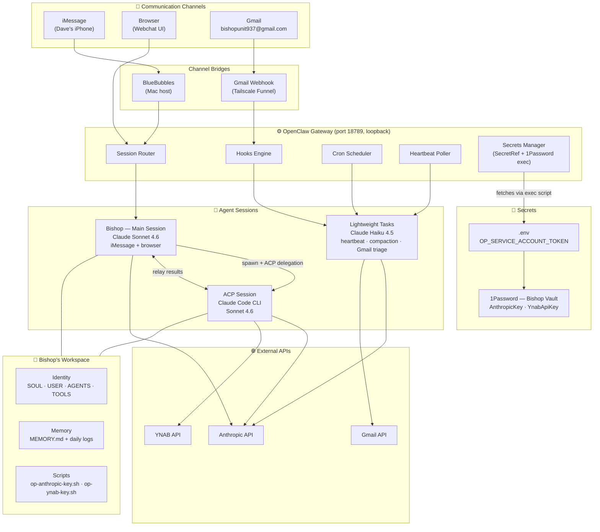
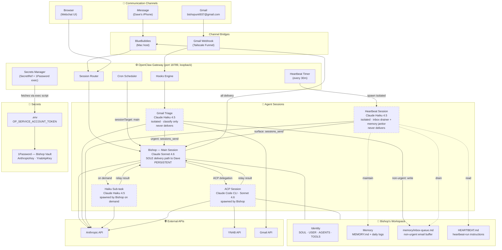

# Bishop Architecture

## Before (pre-2026-04-21)

**Problem:** Hooks, crons, and heartbeat all routed to an isolated Haiku session that delivered directly to Dave — no shared context with Bishop's main session. Dave got messages from two different "Bishops" with no awareness of each other. Crons didn't know if a conversation was active. Gmail had no context about Dave's day.

---

## After (target architecture)

**Key principle:** Haiku never delivers to Dave. It only triages or does sub-work and hands results back to Bishop. Bishop is the single voice.

| Input | Path | Model |
|-------|------|-------|
| iMessage / browser | → main session directly | Sonnet |
| Crons | → main session (`sessionTarget: main`) | Sonnet |
| Heartbeat tick | → isolated Haiku session → drains inbox-queue, maintains memory → `sessions_send` to Bishop when actionable | Haiku (+ Sonnet only if surfaced) |
| Gmail urgent | → Haiku triage → `sessions_send` → Bishop | Haiku + Sonnet |
| Gmail non-urgent | → Haiku triage writes to `inbox-queue.md` → heartbeat drains → `sessions_send` to Bishop if warranted | Haiku only until surfaced |
| Complex tasks | → Bishop spawns ACP, relays result | Sonnet + ACP |
| Lightweight sub-tasks | → Bishop spawns Haiku, relays result | Haiku |

---

## Channel Extensibility

**Principle:** Every user-facing channel delivers to and from the main session. No channel bypasses Bishop. Cheap triage and sub-tasks may run outside main, but their output flows back through Bishop before reaching Dave.

**Adding a new channel (Slack, Discord, SMS, Signal, etc.):**
1. openclaw `ChannelPlugin` for inbound parsing + outbound delivery, configured under `channels.<name>`.
2. Ingress routing: either `dmScope: "main"` for that channel, or hook mapping with static `sessionKey: "main"` (requires `"main"` in `allowedSessionKeyPrefixes`).
3. No bespoke per-channel session logic. Channel identity and threading keys (Slack `thread_ts`, email `Message-ID`, Discord reply) travel on the message envelope.

**Known gotcha:** `session.dmScope` defaults to `"per-channel-peer"`. iMessage lands in `main` today only because BlueBubbles routes by convention. Any new channel added without addressing `dmScope` will silently create per-peer sessions and break the single-voice principle.

**Triage vs. direct per channel:**

| Channel | Pattern | Why |
|---|---|---|
| iMessage | Direct → main | Dave is the only sender, always intentional |
| Browser webchat | Direct → main | Same |
| Gmail | Haiku triage → main | High volume, mostly non-urgent; classification pays for itself |
| Slack / Discord (future) | Direct → main | Low volume, interactive; add triage only if noise warrants |
| SMS (future) | Direct → main | Same reasoning as iMessage |

---

## Operational Guarantees

The single-session pattern has known failure modes. These must be addressed in config and AGENTS.md, not left implicit.

### Context and compaction
- Main session accumulates all channels until 4 AM reset or compaction fires.
- Compactor model: Haiku (configured). Verify compaction threshold is aggressive enough for a multi-channel day.
- Post-compaction reinjected sections: `postCompactionSections: ["Session Startup", "Red Lines"]` (openclaw default). AGENTS.md must have these named sections containing non-negotiable invariants.
- MEMORY.md is the durable cross-reset substrate. Anything Bishop needs past 4 AM goes there, not the transcript.

### Inbox-queue drain
- Gmail triage writes non-urgent emails to `memory/inbox-queue.md`.
- **Heartbeat owns the drain.** Each tick, the isolated heartbeat session reads the queue, decides whether anything has become worth surfacing (age, accumulation, topic), and `sessions_send`s a consolidated note into Bishop. Drained entries are trimmed from the file.
- **Failsafe:** Bishop's AGENTS.md "Session Startup" section instructs Bishop to check `inbox-queue.md` directly if recent turns reference it. Catches missed drain cycles (heartbeat disabled, clock skew, etc.).

### Heartbeat
- **Role:** Inbox drainer + memory janitor. Not a delivery channel, not a proactive-reminder channel (crons handle named reminders).
- **Isolation:** Runs in isolated Haiku session (`heartbeat.isolatedSession: true`). Does not see Bishop's transcript. This is the critical cost setting — without it, every tick pays Haiku-priced input on the full accumulated main session.
- **Reads:** `HEARTBEAT.md` (instructions), `memory/inbox-queue.md` (to drain), recent `memory/YYYY-MM-DD.md` (for maintenance).
- **Writes:** Distilled entries into `MEMORY.md`, trimmed queue entries in `inbox-queue.md`.
- **Delivers:** Only via `sessions_send` into Bishop when something needs Dave's attention. **Never directly to Dave. Never to iMessage.** Bishop decides how / whether to surface.
- **Quiet rules:** Late night (11 PM - 8 AM) stay silent unless genuinely urgent. If Bishop has texted Dave within the last 30 min, stay silent unless the signal is materially different.
- **Default response:** `HEARTBEAT_OK` with no surfacing. Silent is the norm.

### Idle-gating for scheduled sends
- Crons (medication, wind-down) and heartbeat-triggered proactive messages must not interrupt an active conversation.
- Convention: cron payload includes "only deliver if last user message > 10 min ago; otherwise log and skip."

### Triage decision logging
- Haiku's urgent/non-urgent call is load-bearing. A missed urgent = silent failure.
- Log every triage decision to `logs/gmail-triage.jsonl` (input subject/from + decision + reasoning). Sample-audit weekly until calibrated.

### Canary / persona check
- One voice = one point of persona failure. A bug in AGENTS.md hits every channel simultaneously.
- Browser webchat serves as a low-stakes canary; drift shows up there before it reaches iMessage.

### Cost model
Sonnet cost scales with (main session turns × average context size). The main risk is context accumulation over a long day. Known leaks to audit:

1. **Heartbeat reads full main history.** Default `heartbeat.isolatedSession: false` pays Haiku-priced input on the full accumulated main transcript every 30 min. Setting to `true` (heartbeat reads only `HEARTBEAT.md`) is likely the single biggest cost win.
2. **Triage relays full email body to main.** Haiku should `sessions_send` a 1-sentence summary + label, not the body. Body stays in Haiku's ephemeral session.
3. **Sub-task result relay.** ACP and Haiku sub-task outputs can be long; summarize before injecting back into Bishop.
4. **Compaction aggressiveness.** Verify compaction fires mid-day on heavy days, not only at 4 AM reset.

---

## Implementation Status

| # | What | File | Priority | Status |
|---|------|------|----------|--------|
| 0 | Live bug: Gmail hook had Haiku delivering directly to Dave — subsumed into item 4 | `~/.openclaw/openclaw.json` L180-182 | **NOW** | ✅ Done (2026-04-22) |
| 1 | Crons → `sessionTarget: main` | `~/.openclaw/cron/jobs.json` | — | ✅ Done |
| 1a | **Payload kind mismatch:** yesterday's `sessionTarget: "main"` fix left `payload.kind: "agentTurn"` unchanged, but main-targeted crons require `payload.kind: "systemEvent"` with a `text` field. All 3 reminders silently skipped for ~24h with `lastError: "main job requires payload.kind=\"systemEvent\""`. Also added `failureAlert` per job so a future silent-skip surfaces to Dave within one cycle. | `~/.openclaw/cron/jobs.json` | **NOW** | ✅ Done (2026-04-22) |
| 1b | **BlueBubbles Private-API dependency:** typing indicators (`agents.defaults.typingMode`) and read receipts (`channels.bluebubbles.sendReadReceipts`) both require the BlueBubbles Private API helper on the Mac host. Helper is not installed, so those calls hang and AbortController times out → *whole Bishop turn* aborts with `"This operation was aborted"` (surfaced as `[bluebubbles] final reply failed` and as cron `lastErrorReason: "timeout"`). Disabled both in config. Sends now rely on the BB public API only; no helper install needed. If Dave wants typing/read-receipt UX later, install the BB Private API helper on the host and flip both back on. | `~/.openclaw/openclaw.json` | **NOW** | ✅ Done (2026-04-22) |
| 2 | Strip "Route to Haiku:" from cron payloads | `~/.openclaw/cron/jobs.json` | Next | ✅ Done (2026-04-22) |
| 3 | Update AGENTS.md routing section; ensure "Session Startup" + "Red Lines" sections exist with inbox-queue drain + guardrails | `workspace/AGENTS.md` | Next | ✅ Done (2026-04-22) |
| 4 | Gmail hook → Haiku triage → `sessions_send` pattern (`deliver: false`, triage produces 1-sentence summary, not body) | `~/.openclaw/openclaw.json` | Next | ✅ Done (2026-04-22) |
| 5 | Archive SESSION-ROUTING.md (superseded) | `workspace/projects/SESSION-ROUTING.md` | Later | ✅ Done (2026-04-22) — moved to `projects/archive/` |
| 6 | ~~Revisit~~ Archive model-tiering.md — superseded, design was never quite right | `workspace/projects/model-tiering.md` | Later | ✅ Done (2026-04-22) — moved to `projects/archive/` |
| 7 | Set `heartbeat.isolatedSession: true` (biggest cost win — see Cost model above) | `~/.openclaw/openclaw.json` | Next | ✅ Done (2026-04-22) |
| 8 | Add `"main"` to `hooks.allowedSessionKeyPrefixes` if any hook needs to target main directly | `~/.openclaw/openclaw.json` | If needed | ⚪ Not needed — Gmail uses triage+sessions_send, not direct |
| 9 | Decide `session.dmScope` policy (flip to `"main"` globally, or document per-channel override requirement) | `~/.openclaw/openclaw.json` | Next | ✅ Done (2026-04-22) — flipped to `"main"` |
| 10 | Idle-gating convention in cron payloads (only deliver if last-user-message > 10 min) | `~/.openclaw/cron/jobs.json` | Later | ⏳ Pending |
| 11 | Triage decision logging to `logs/gmail-triage.jsonl` | Haiku triage prompt | Later | ⏳ Pending |
| 12 | Rewrite `HEARTBEAT.md` for new pattern (no direct delivery, drain inbox-queue, memory maintenance, `sessions_send` only). Current content tells Haiku to "text Dave" — same split-voice bug class as item 0 | `workspace/HEARTBEAT.md` | Next | ✅ Done (2026-04-22) |

---

## Answers from Opus 4.7 (2026-04-22)

1. **`wakeMode: "next-heartbeat"`** injects into the existing session named by `sessionKey` (does not spawn). Degrades to `"now"` behavior if heartbeat is disabled. Safe default for non-urgent hooks.
2. **`HookMappingConfig` has no `sessionTarget`, only `sessionKey`** — confirmed. Two valid paths:
   - **Direct**: static `sessionKey: "main"` (requires adding `"main"` to `hooks.allowedSessionKeyPrefixes`). Simpler, no triage layer.
   - **Triage**: templated `sessionKey: "hook:gmail:{{id}}"` with `deliver: false`, Haiku session calls `sessions_send` into main. This is the chosen pattern for Gmail.
3. **Main session key is `"main"`** (openclaw `DEFAULT_MAIN_KEY`). Stable across the 4 AM daily reset — transcript archives, key persists.

---

## Session Notes — April 21, 2026

**Saved by:** Claude Code (ACP session — Bishop's gateway was down, worked directly on files)

### What was done tonight

Gateway was failing with two sequential errors:
1. `hooks.allowedSessionKeyPrefixes is required when a hook mapping sessionKey uses templates`
2. `hooks.defaultSessionKey must match hooks.allowedSessionKeyPrefixes`

**Fix applied:** Added `"allowedSessionKeyPrefixes": ["hook:"]` to `hooks` section of `openclaw.json`. Covers both `hook:ingress` (defaultSessionKey) and `hook:gmail:*` (template keys). Gateway is now up.

Git commit **`7770cdf`** — "refactor to single-session architecture: all crons route through main session" — refactored `AGENTS.md` routing section to reflect the single-session decision.

### Pending fixes (exact details)

**1. Cron payloads — `~/.openclaw/cron/jobs.json`**
All three jobs have stale "Route to Haiku:" instructions that contradict the new architecture:
- `medication-noon`: `"...Route to Haiku: send a brief, warm reminder..."`
- `medication-3pm`: `"...Route to Haiku: send a brief, warm reminder..."`
- `winddown-9pm`: `"...Route to Haiku: ask what his plan is for the night..."`
Strip the "Route to Haiku:" prefix from each. Bishop handles these directly.

**2. AGENTS.md — `workspace/AGENTS.md` ~line 182**
Routing section still lists Haiku as an option for cron signals. Should say Bishop handles cron signals directly, period.

**3. Gmail hook — `~/.openclaw/openclaw.json`**
Current: `sessionKey: "hook:gmail:{{messages[0].id}}"` — new isolated session per email.
Target: implement Haiku triage → `sessions_send` pattern (see After diagram above).
Interim option: change to `sessionKey: "hook:ingress"` to at least stop per-email isolation.

**4. SESSION-ROUTING.md — `workspace/projects/SESSION-ROUTING.md`**
The peer-mesh/`check_routing.py` approach is superseded. Archive or delete.

**5. model-tiering.md — `workspace/projects/model-tiering.md`**
Targets 70-80% Haiku. No longer accurate — Haiku is only for heartbeat, compaction, and Bishop-spawned sub-tasks. Revisit projections.

### System state as of tonight

- Gateway: **up**, launchd service `ai.openclaw.gateway`, port 18789
- iMessage via BlueBubbles: working
- Gmail hook: wired but broken (per-email isolated sessions) — fix pending
- Cron jobs: `sessionTarget: "main"` ✓ — payloads have stale Haiku instructions ✗
- ACP: enabled, `permissionMode: approve-all`
- 1Password: working, token in `~/.openclaw/.env`

---

## Infrastructure

- **Gateway:** OpenClaw, port 18789, loopback, launchd service (`ai.openclaw.gateway`)
- **Secrets:** 1Password exec via `op-anthropic-key.sh` — token in `~/.openclaw/.env`
- **ACP:** `acpx` backend, `permissionMode: approve-all`
- **Session resets:** daily at 4 AM, idle timeout 60 min
